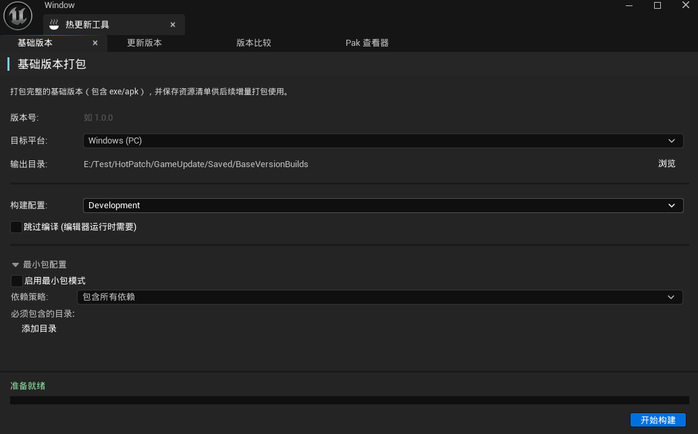
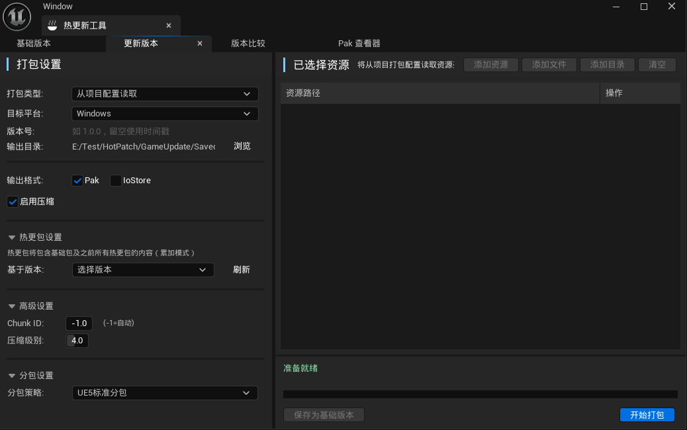

# HotUpdatePlugin

Unreal Engine 5.7 热更新（OTA 补丁）插件，支持 Pak/IoStore 打包、增量/差异更新、版本对比和运行时补丁下载挂载。

## 目录

- [功能特性](#功能特性)
- [环境要求](#环境要求)
- [快速开始](#快速开始)
- [打包命令](#打包命令)
- [分包功能](#分包功能)
- [项目架构](#项目架构)
- [目录结构](#目录结构)
- [配置参考](#配置参考)
- [常见问题](#常见问题)
- [License](#license)

## 功能特性

| 功能 | 说明 |
|------|------|
| 运行时热更新 | 检测版本 → 下载补丁 → 挂载 Pak，全流程自动化 |
| 增量更新 | 基于 IoStore 容器级别的差异下载，仅下载哈希变化的容器 |
| 多平台下载 | HTTP 下载器（桌面）、Android 原生 DownloadManager、iOS NSURLSession 后台传输，支持暂停/恢复/重试 |
| Pak 挂载 | 运行时动态挂载/卸载 Pak 文件，支持加密密钥注册 |
| 版本管理 | JSON 清单格式（latest.json 两步发现），支持链式更新（1.0.0 → 1.0.1 → 1.0.2） |
| 编辑器工具 | 4 合 1 Slate 面板：基础包构建、补丁打包、版本对比、Pak 查看器 |
| Blueprint 支持 | 所有运行时 API 均可从蓝图调用 |
| 分包功能 | 支持 6 种分包策略，灵活管理资源模块化下载 |
| 最小包模式 | 首包瘦身，pakchunk0 随安装包分发，pakchunk1+ 通过 CDN 热更新下载 |

## 环境要求

- Unreal Engine 5.7
- Visual Studio 2022 / Rider
- Android SDK（Android 打包需要）
- Windows / Android / iOS 平台

## 快速开始

### 打开项目

1. 克隆仓库
2. 右键 `GameUpdate.uproject` → Generate Visual Studio project files
3. 打开 `GameUpdate.uproject`

### 配置热更新服务器

编辑 `Config/DefaultGame.ini`，填写服务器地址：

```ini
[/Script/HotUpdate.HotUpdateSettings]
; ManifestUrl 指向 latest.json（版本发现入口），不是 manifest.json 本身
ManifestUrl="http://your-server.com/hotpatch/latest.json"
ResourceBaseUrl="http://your-server.com/hotpatch/"
bAllowHttpConnection=True
```

同时在 `Config/DefaultEngine.ini` 中配置自定义 AssetManager（分包必需）：

```ini
[/Script/Engine.Engine]
AssetManagerClassName=/Script/HotUpdate.HotUpdateAssetManager
```

### C++ 快速示例

```cpp
#include "HotUpdateManager.h"

void StartHotUpdate()
{
    UHotUpdateManager* Manager = GetGameInstance()->GetSubsystem<UHotUpdateManager>();
    Manager->OnVersionCheckComplete.AddDynamic(this, &MyClass::OnCheckComplete);
    Manager->CheckForUpdate();
}

void OnCheckComplete(const FHotUpdateVersionCheckResult& Result)
{
    if (Result.bHasUpdate)
    {
        UE_LOG(LogTemp, Log, TEXT("发现新版本: %s"), *Result.LatestVersion.VersionString);
        Manager->StartDownload();
    }
}
```

> **注意**：当 `bAutoDownload=True` 时，`CheckForUpdate()` 检测到更新后会自动调用 `StartDownload()`，无需手动调用。

### 蓝图调用

所有运行时 API 均可在蓝图中直接调用：

1. 获取 `HotUpdateManager` Subsystem
2. 调用 `CheckForUpdate` 检查更新
3. 绑定 `OnVersionCheckComplete` 事件处理结果
4. 调用 `StartDownload` 开始下载
5. 绑定 `OnDownloadProgress` 监控进度
6. 调用 `ApplyUpdate` 应用补丁

## 打包命令

在编辑器中通过 **HotUpdateEditor** 面板操作，或使用命令行：

### 包类型说明

**基础包**：包含完整游戏资源的初始版本包



**更新包**：基于基础包的差异补丁，仅包含变更资源



### 标准打包

```bash
# 构建基础包
UnrealEditor-Cmd GameUpdate -run=HotUpdate -mode=base -version=1.0.0 -platform=Windows

# 构建增量补丁
UnrealEditor-Cmd GameUpdate -run=HotUpdate -mode=patch -version=1.0.1 -baseversion=1.0.0 -platform=Windows
```

**完整参数说明**：

| 参数 | 适用模式 | 说明 |
|------|----------|------|
| `-mode=` | both | 打包模式：`base`（基础包）或 `patch`（补丁包） |
| `-version=` | both | 版本号（如 `1.0.0`） |
| `-baseversion=` | patch | 基础版本号（patch 模式必需） |
| `-platform=` | both | 目标平台：`Windows`、`Android`、`IOS` |
| `-output=` | both | 输出目录路径（可选，有默认值） |
| `-manifest=` | patch | 基础版本 manifest.json 路径（可选，自动搜索 `HotUpdateVersions/<ver>/` 和 `BaseVersionBuilds/<ver>/`） |
| `-shipping` | base | 发布版本构建（默认 Development） |
| `-skipbuild` | both | 跳过编译步骤 |
| `-minimal` | base | 启用最小包模式 |
| `-whitelist=` | base | 白名单目录（分号分隔，如 `/Game/UI;/Game/Startup`） |
| `-textureformat=` | base | Android 纹理格式：`ETC2`、`ASTC`、`DXT`、`Multi` |
| `-includebasecontainers` | patch | 包含基础版本容器（完整热更模式） |
| `-basecontainerdir=` | patch | 基础容器目录路径（可选，自动搜索） |
| `-skipcook` | patch | 跳过 Cook 步骤 |
| `-incrementalcook` | patch | 增量 Cook（仅 Cook 变更资产） |
| `-help` | both | 显示帮助 |

### 最小包模式打包

最小包模式用于构建"瘦身"首包，将 pakchunk1+ 资源分离到热更新目录，仅 pakchunk0 打包到最终安装包。

> **注意**：最小包模式依赖 UAT Automation 脚本（`Build/AutomationScripts/StripExtraPakChunks.Automation.csproj`），
> 该 `.automation.csproj` 文件必须与 `.Automation.cs` 源码一同存在，UAT 才能发现、编译并加载 `CustomStagingHandler`。

**Windows 平台**：

```bash
UnrealEditor-Cmd GameUpdate -run=HotUpdate -mode=base -version=1.0.0 \
    -platform=Windows \
    -minimal \
    -whitelist="/Game/UI;/Game/Startup"
```

**Android 平台**：

```bash
UnrealEditor-Cmd GameUpdate -run=HotUpdate -mode=base -version=1.0.0 \
    -platform=Android \
    -minimal \
    -whitelist="/Game/UI;/Game/Startup" \
    -textureformat=ASTC
```

**最小包参数说明**：

| 参数 | 说明 |
|------|------|
| `-minimal` | 启用最小包模式 |
| `-whitelist=<paths>` | 白名单目录（分号分隔），必须打包到 Chunk 0 |
| `-textureformat=<fmt>` | Android 纹理格式：ETC2、ASTC、DXT、Multi（Android 必需） |

### 部署到服务器

使用 `upload_hotpatch.py` 脚本将构建产物上传到 CDN 服务器：

```bash
# 安装依赖
pip install paramiko

# 执行上传（需修改脚本中的服务器地址和版本号配置）
python upload_hotpatch.py
```

脚本工作流程：

1. 通过 SSH/SFTP 连接服务器
2. 上传 `Saved/HotUpdateVersions/<version>/<platform>/` 目录
3. 上传 `Saved/HotUpdatePatches/<version>/<platform>/` 目录
4. 在服务器生成 `latest.json`（指向最新版本的 manifest.json）
5. 设置文件权限并验证 HTTP 可访问

`latest.json` 格式示例：

```json
{ "manifestUrl": "http://your-server.com/hotpatch/1.0.1/Windows/manifest.json" }
```

> **提示**：使用前需修改脚本中的 `SERVER_HOST`、`REMOTE_BASE_DIR`、版本号等配置项。

## 分包功能

插件支持将游戏资源按不同策略划分到多个 Chunk 中，便于实现增量下载、模块化管理和按需加载。

### 分包策略

| 策略 | 说明 | 适用场景 |
|------|------|----------|
| `None` | 不分包，所有资源打包成一个 Chunk | 小型项目、快速原型 |
| `Size` | 按大小分包，超过 MaxChunkSizeMB 自动分割 | 控制单个包体积 |
| `Directory` | 按目录分包，根据规则将指定目录独立打包 | 模块化项目结构 |
| `AssetType` | 按资源类型分包（Texture、Material、Mesh 等） | 资源类型隔离管理 |
| `PrimaryAsset` | UE5 标准 Primary Asset 分包（默认） | 标准游戏资源管理 |
| `Hybrid` | 混合模式：目录优先 + 其余按大小分包 | 精细化分包控制 |

### 配置方式

#### 编辑器面板配置

在 **HotUpdateEditor** 的 Base Version Panel 中配置分包参数：

- **分包策略**：选择 ChunkStrategy
- **目录分包规则**：添加 DirectoryChunkRules
- **按大小分包配置**：设置 SizeBasedConfig
- **最小包模式**：启用 MinimalPackage 并配置白名单

#### 代码配置示例

```cpp
// 基础版本构建配置
FHotUpdateBaseVersionBuildConfig Config;
Config.VersionString = "1.0.0";
Config.Platform = EHotUpdatePlatform::Windows;
Config.BuildConfiguration = EHotUpdateBuildConfiguration::Development;

// 最小包模式配置（可选）
Config.MinimalPackageConfig.bEnableMinimalPackage = true;
```

### 目录分包规则字段

| 字段 | 类型 | 说明 |
|------|------|------|
| `DirectoryPath` | FString | 要分包的目录路径（如 `/Game/Maps`） |
| `ChunkName` | FString | Chunk 名称（如 `Maps`） |
| `ChunkId` | int32 | 指定 Chunk ID（-1 自动分配） |
| `Priority` | int32 | 加载优先级（越小越先加载） |
| `MaxSizeMB` | int32 | 该 Chunk 最大大小（0 = 无限制） |
| `bRecursive` | bool | 是否递归匹配子目录 |
| `ExcludedSubDirs` | TArray\<FString\> | 排除的子目录列表 |

### 按大小分包配置字段

| 字段 | 类型 | 说明 |
|------|------|------|
| `MaxChunkSizeMB` | int32 | 最大 Chunk 大小（默认 256MB） |
| `ChunkNamePrefix` | FString | Chunk 名称前缀（默认 `Chunk`） |
| `ChunkIdStart` | int32 | Chunk ID 起始值 |
| `bSortBySize` | bool | 是否按大小排序（大资源优先） |
| `bBalanceDistribution` | bool | 是否均衡分布（各 Chunk 大小接近） |

### 最小包模式

最小包模式用于构建只包含必要资源的"瘦身"基础包，其余资源通过热更新下载。

```cpp
// 最小包配置
FHotUpdateMinimalPackageConfig MinimalConfig;
MinimalConfig.bEnableMinimalPackage = true;

// 白名单目录（必须打包到 Chunk 0）
MinimalConfig.WhitelistDirectories.Add(FDirectoryPath{"/Game/UI"});
MinimalConfig.WhitelistDirectories.Add(FDirectoryPath{"/Game/Startup"});

// 依赖处理策略
MinimalConfig.DependencyStrategy = EHotUpdateDependencyStrategy::HardOnly;  // 仅硬依赖
MinimalConfig.MaxDependencyDepth = 0;  // 无限制
```

**依赖处理策略**：

| 策略 | 说明 |
|------|------|
| `IncludeAll` | 包含所有依赖（硬依赖 + 软依赖） |
| `HardOnly` | 仅硬依赖（必须的引用） |
| `SoftOnly` | 仅软依赖（可选引用） |
| `None` | 不包含依赖 |

### 运行时 Chunk 管理

运行时通过 `UHotUpdatePakManager` 管理 Chunk 的挂载和卸载：

```cpp
// 获取 Chunk 信息
TArray<FHotUpdateChunkInfo> Chunks = HotUpdateManager->GetLoadedChunks();

// Chunk 按 Priority 顺序挂载（优先级小的先加载）
// 依赖关系自动处理：父 Chunk 先于子 Chunk 加载

// Chunk 加载状态
EHotUpdateChunkState State = HotUpdateManager->GetChunkState(ChunkId);
```

## 项目架构

### 插件模块

| 模块 | 类型 | 说明 |
|------|------|------|
| HotUpdate | Runtime | 运行时热更新核心，随游戏发布 |
| HotUpdateEditor | Editor | 编辑器打包工具，仅开发时使用 |

### 运行时核心类

| 类 | 说明 |
|----|------|
| `UHotUpdateManager` | 核心调度器，流程：CheckForUpdate → StartDownload → ApplyUpdate |
| `UHotUpdateDownloaderBase` | 下载器抽象基类，定义统一接口和工厂方法 `CreateDownloader()` |
| `UHotUpdateHttpDownloader` | HTTP 并发下载（Windows/Mac/Linux），基于 UE FHttpModule，暂停/恢复/断点续传 |
| `UHotUpdateAndroidDownloader` | Android 原生下载，通过 JNI 调用 DownloadManager API，App 挂起后继续下载 |
| `UHotUpdateIOSDownloader` | iOS 后台下载，通过 NSURLSession background transfer，App 进入后台后继续下载 |
| `UHotUpdatePakManager` | Pak/IoStore 挂载/卸载/校验，加密密钥注册 |
| `UHotUpdateManifestParser` | JSON 清单解析/保存 |
| `UHotUpdateIncrementalCalculator` | 增量差异计算 |
| `UHotUpdateVersionStorage` | 本地版本与 manifest 持久化 |
| `UHotUpdateAssetManager` | 自定义 AssetManager，替换 UE 默认 AssetManager 实现 Chunk 分配 |
| `UHotUpdateSettings` | 开发者配置（服务器地址、并发数、路径等） |

### 下载模块架构

下载模块使用工厂模式，在编译时根据目标平台选择下载器实现：

```cpp
UHotUpdateDownloaderBase* UHotUpdateDownloaderBase::CreateDownloader(UObject* Outer)
{
#if PLATFORM_ANDROID
    return NewObject<UHotUpdateAndroidDownloader>(Outer);
#elif PLATFORM_IOS
    return NewObject<UHotUpdateIOSDownloader>(Outer);
#else
    return NewObject<UHotUpdateHttpDownloader>(Outer);
#endif
}
```

**三平台实现对比**：

| 特性 | HttpDownloader（桌面） | AndroidDownloader | IOSDownloader |
|------|----------------------|-------------------|----------------|
| 下载引擎 | UE FHttpModule（IHttpRequest） | Android DownloadManager（JNI） | NSURLSession background transfer |
| 并发控制 | ActiveRequests 数组，上限 MaxConcurrentDownloads | JNI EnqueueDownloadRequest | FIOSSessionWrapper |
| 暂停/恢复 | 取消请求 + 保留临时文件，HTTP Range 续传 | RemoveDownload + 重新入队 | NSURLSessionDownloadTask suspend/resume |
| 进度追踪 | HTTP 回调 | 定时器轮询 JNI 状态 | delegate 回调 + 定时器 |
| 后台下载 | 不支持 | 支持（DownloadManager） | 支持（background session） |

所有下载器共享同一任务队列模式：`PendingTasks → ActiveTasks → CompletedTasks`。基类 `UHotUpdateDownloaderBase` 提供了 `AddDownloadTasks` 和 `AddContainerDownloadTasks` 的默认实现（遍历调用 `AddDownloadTask`），子类只需重写单任务接口。

### 版本发现与增量更新

#### latest.json 两步版本发现

`CheckForUpdate()` 是两步流程，不是单次 HTTP 请求：

1. 请求 `ManifestUrl`（配置为 `latest.json` 的固定 URL）
2. 若响应包含 `manifestUrl` 字段，则再请求该 URL 获取实际 `manifest.json`
3. 若无 `manifestUrl`，将响应本身作为 manifest 解析（向后兼容）

这种设计将"最新版本是什么"的查询与 manifest 本身解耦，服务端只需维护一个轻量级的重定向文件。

#### 容器级增量下载

增量比较在 **IoStore 容器级别**进行（不是单个文件级别）：

1. `CalculateIncrementalDownload()` 按 `ChunkId` 比较本地与服务端 manifest 中每个容器的 `UcasHash` 和 `UtocHash`
2. 哈希相同的容器整体跳过，不重复下载
3. 增量单位是 `.utoc` + `.ucas` 对，不是单个资产

更新成功后，`UHotUpdateVersionStorage` 将完整服务端 manifest 缓存到本地磁盘。下次 `CheckForUpdate()` 时加载缓存 manifest 与服务端比较计算增量下载列表。无本地 manifest 时执行全量下载。

#### Auto-Download

`bAutoDownload=True` 时，`CheckForUpdate()` 检测到更新后自动在 `HandleVersionCheckResponse` 回调中调用 `StartDownload()`，一次 `CheckForUpdate()` 调用即可触发整个下载流程。

### 编辑器面板

| 面板 | 说明 |
|------|------|
| Base Version Panel | 构建完整基础包 |
| Packaging Panel | 构建补丁/差异包 |
| Version Diff Panel | 版本对比 |
| Pak Viewer Panel | 查看 Pak/IoStore 内容 |

### 数据流

```
编辑器: 资产 → Chunk 分配 → IoStore 构建 → 清单生成 → 版本注册
运行时: 检查更新(HTTP) → 解析清单 → 增量计算(容器级) → 下载(并发) → 校验哈希 → 挂载Pak → 更新版本
```

## 目录结构

```
GameUpdate/
├── Config/                          # 项目配置
├── Content/                         # UE 资产
├── Source/GameUpdate/               # 游戏模块
│   └── UI/HotUpdateWidget.h         # 运行时 UMG 热更新界面
├── Plugins/HotUpdatePlugin/
│   └── Source/
│       ├── HotUpdate/               # 运行时模块
│       │   ├── Public/              # 头文件
│       │   │   ├── Core/            # 核心类
│       │   │   │   ├── HotUpdateManager.h           # 核心调度器
│       │   │   │   ├── HotUpdateSettings.h          # 开发者配置
│       │   │   │   ├── HotUpdateTypes.h             # 核心类型定义
│       │   │   │   ├── HotUpdatePakTypes.h           # Pak 相关类型
│       │   │   │   └── HotUpdateVersionStorage.h     # 版本持久化
│       │   │   ├── Download/        # 下载相关
│       │   │   │   ├── HotUpdateDownloaderBase.h     # 下载器抽象基类 + 工厂
│       │   │   │   ├── HotUpdateHttpDownloader.h     # HTTP 下载器（桌面平台）
│       │   │   │   ├── HotUpdateAndroidDownloader.h  # Android 原生下载器
│       │   │   │   └── HotUpdateIOSDownloader.h     # iOS 后台下载器
│       │   │   ├── Manifest/        # 清单相关
│       │   │   │   ├── HotUpdateManifest.h           # 清单数据结构与解析
│       │   │   └── Pak/             # Pak 管理
│       │   │       ├── HotUpdatePakManager.h         # Pak 挂载/卸载/校验
│       │   │   ├── HotUpdateAssetManager.h           # 自定义 AssetManager
│       │   │   └── HotUpdateFileUtils.h              # 文件工具类
│       │   └── Private/             # 实现文件
│       └── HotUpdateEditor/         # 编辑器模块
│           ├── Public/
│           │   ├── HotUpdateEditorTypes.h            # 编辑器类型定义
│           │   ├── HotUpdateCommandlet.h             # 命令行打包入口
│           │   └── ...
│           └── Private/
│               └── Widgets/         # Slate 面板
├── Build/                           # 自动化脚本
│   └── AutomationScripts/           # UAT Automation 模块
│       ├── StripExtraPakChunks.Automation.cs     # CustomStagingHandler 源码
│       └── StripExtraPakChunks.Automation.csproj # UAT 模块项目文件（必须）
└── upload_hotpatch.py               # 部署脚本：上传热更文件并生成 latest.json
```

## 配置参考

### DefaultGame.ini

```ini
[/Script/HotUpdate.HotUpdateSettings]
; 服务器配置
ManifestUrl="http://your-server.com/hotpatch/latest.json"  ; 版本发现入口（latest.json）
ResourceBaseUrl="http://your-server.com/hotpatch/"          ; 资源下载基础 URL，支持 {version} 占位符
bAllowHttpConnection=True                                    ; 允许 HTTP 连接（生产环境建议使用 HTTPS）
bAutoDownload=True                                           ; 检测到更新后自动下载

; 下载配置（可在 ini 中覆盖默认值）
; MaxConcurrentDownloads=3
; MaxRetryCount=3
; RetryInterval=2.0
; bEnableResume=True
; DownloadTimeout=300.0

; 存储配置
; LocalPakDirectory="Saved/HotUpdate"
; MaxLocalVersionCount=3
; bAutoCleanupOldVersions=True

; 行为配置
; bAutoCheckOnStartup=True

; 最小包配置
; bEnableMinimalPackage=False
; +WhitelistDirectories=/Game/UI

[/Script/UnrealEd.ProjectPackagingSettings]
bGenerateChunks=True                                        ; 启用分包（最小包模式必需）
```

### DefaultEngine.ini

```ini
[/Script/Engine.Engine]
AssetManagerClassName=/Script/HotUpdate.HotUpdateAssetManager  ; 使用自定义 AssetManager（分包必需）
```

### 调试日志

```ini
[Core.Log]
LogHotUpdate=Verbose
LogHotUpdateEditor=Verbose
```

## 常见问题

### Pak 挂载失败怎么办？

检查以下项：

1. Pak 文件路径是否正确（相对路径应基于项目根目录）
2. 加密密钥是否已注册（通过 `RegisterEncryptionKey`）
3. Pak 文件是否已损坏（校验 SHA1 哈希值）
4. Chunk 加载顺序是否正确（依赖关系需先加载父 Chunk）

### 如何调试热更新流程？

在 `Config/DefaultGame.ini` 中启用调试日志：

```ini
[Core.Log]
LogHotUpdate=Verbose
LogHotUpdateEditor=Verbose
```

同时可在蓝图或 C++ 中绑定各个回调事件，监控流程状态。

### 支持哪些平台？下载器如何选择？

当前支持 Windows、Android 和 iOS 平台。下载模块在编译时根据目标平台自动选择实现：

| 平台 | 下载器 | 后台下载 |
|------|--------|----------|
| Windows/Mac/Linux | `UHotUpdateHttpDownloader`（UE FHttpModule） | 不支持 |
| Android | `UHotUpdateAndroidDownloader`（JNI + DownloadManager） | 支持 |
| iOS | `UHotUpdateIOSDownloader`（NSURLSession background transfer） | 支持 |

平台选择通过 `UHotUpdateDownloaderBase::CreateDownloader()` 工厂方法在编译时决定（`#if PLATFORM_*`），非运行时多态。

### 增量更新如何工作？

增量更新通过 `CalculateIncrementalDownload()` 在 **IoStore 容器级别**计算差异：

1. 比对新旧版本 Manifest 中每个 Chunk 下的 IoStore 容器
2. 按 `UcasHash` 和 `UtocHash` 比较，哈希相同的容器整体跳过
3. 仅下载哈希变化的 `.utoc` + `.ucas` 容器对
4. 支持链式更新（1.0.0 → 1.0.1 → 1.0.2）
5. 无本地缓存 manifest 时执行全量下载

> **注意**：增量单位是容器（`.utoc` + `.ucas` 对），不是单个资产文件。

### latest.json 是什么？为什么不是直接请求 manifest.json？

`ManifestUrl` 指向的是一个固定的 `latest.json` URL，而非 manifest 本身。`latest.json` 是一个轻量级重定向文件：

```json
{ "manifestUrl": "http://server/hotpatch/1.0.1/Windows/manifest.json" }
```

好处：
- 版本发布时只需更新 `latest.json`，无需移动 manifest 文件
- 客户端始终请求同一个 URL 即可获取最新版本
- 向后兼容：若 `latest.json` 无 `manifestUrl` 字段，则直接作为 manifest 解析

### HTTP 连接失败

**症状**：`CheckForUpdate` 返回错误，无法获取 Manifest

**解决方案**：

1. 检查 `ManifestUrl` 配置是否正确
2. 检查服务器是否可访问（浏览器直接访问 URL 测试）
3. 检查防火墙/网络代理设置
4. 确保 `bAllowHttpConnection=True`（HTTP 需显式启用，HTTPS 无需此设置）

### Pak 校验失败

**症状**：下载完成后校验哈希不匹配

**解决方案**：

1. 重新下载补丁文件
2. 检查 CDN 文件完整性
3. 确认 Manifest 中的哈希值与实际文件一致
4. 检查是否有文件传输过程中的编码问题

### 版本解析错误

**症状**：Manifest 解析失败，JSON 格式错误

**解决方案**：

1. 检查 Manifest JSON 格式是否正确（使用 JSON 校验工具）
2. 确认版本字符串格式符合规范（如 `1.0.0`）
3. 检查 Manifest 版本号是否与插件兼容（当前版本 2）

### Chunk 加载顺序问题

**症状**：资源加载失败，依赖资源未找到

**解决方案**：

1. 检查 Chunk 的 `Priority` 设置（数值小的先加载）
2. 确认依赖关系配置正确（父 Chunk 先于子 Chunk）
3. 查看日志确认加载顺序

### 最小包 StripExtraPakChunks 未执行

**症状**：最小包模式打包后，staging 目录中仍保留 pakchunk1+ 文件，未被移到热更输出目录

**解决方案**：

1. 确认 `Build/AutomationScripts/StripExtraPakChunks.Automation.csproj` 文件存在 — UAT 只识别 `.automation.csproj` 文件来加载项目 Automation 脚本，仅有 `.Automation.cs` 源码不会被编译加载
2. 检查 UAT 日志中是否有 `Loading script DLL: ...StripExtraPakChunks.Automation.dll` — 如没有说明脚本未被加载
3. 确认打包命令中传入了 `-ScriptsForProject=<.uproject路径>` 参数（由插件自动添加）

### 蓝图调用无响应

**症状**：蓝图调用 `CheckForUpdate` 后无回调

**解决方案**：

1. 确认已正确绑定事件（使用 `BindEvent` 或 `AddDynamic`）
2. 检查目标对象是否有效（未被销毁）
3. 查看日志确认异步任务是否启动

## License

[MIT](LICENSE)

Copyright czm. All Rights Reserved.